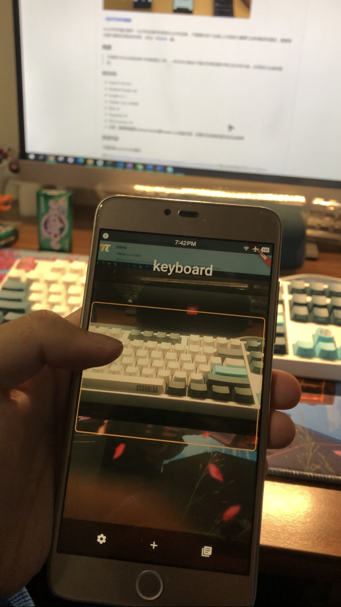
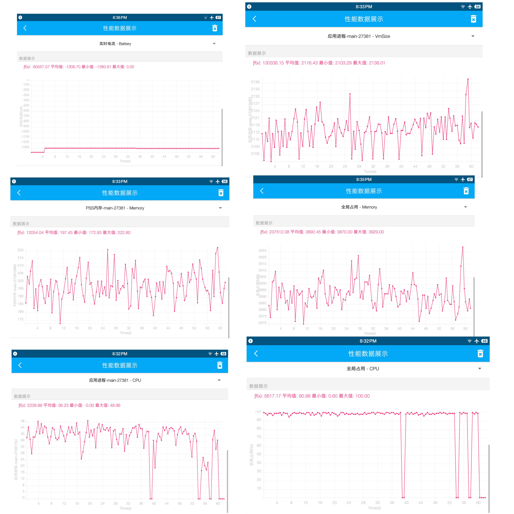

# Namer

A object detection application designed for childeren

 

# UI design

Designed on Sketch, done in sprint 0. However most of function haven't finished since time limited.


# flutter_realtime_detection

Real-time object detection in Flutter using [camera](https://pub.dartlang.org/packages/camera) and [tflite](https://pub.dartlang.org/packages/tflite) plugin. 

## Install 

```
flutter packages get
```

## Run

```
flutter run
```

## Models

- Object Detection
  - SSD MobileNet

## Previews

 

## SoloPi test result

 


Thanks for object detecting examples from:
https://medium.com/@shaqian629/real-time-object-detection-in-flutter-b31c7ff9ef96.


